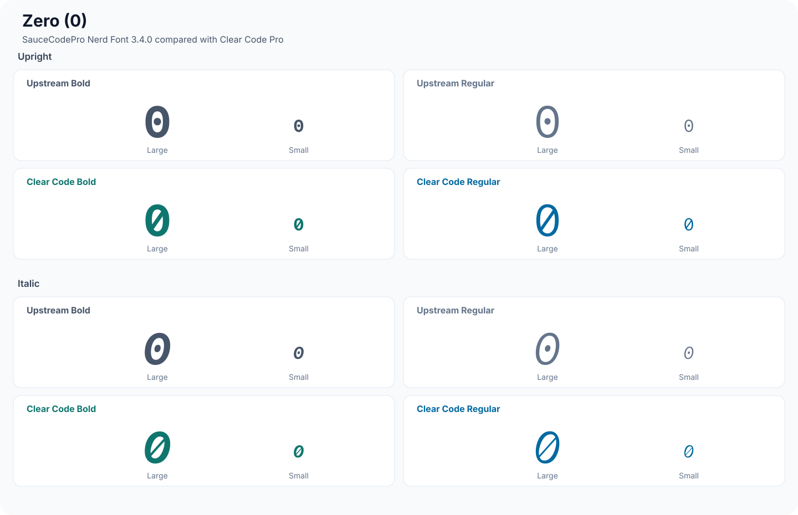
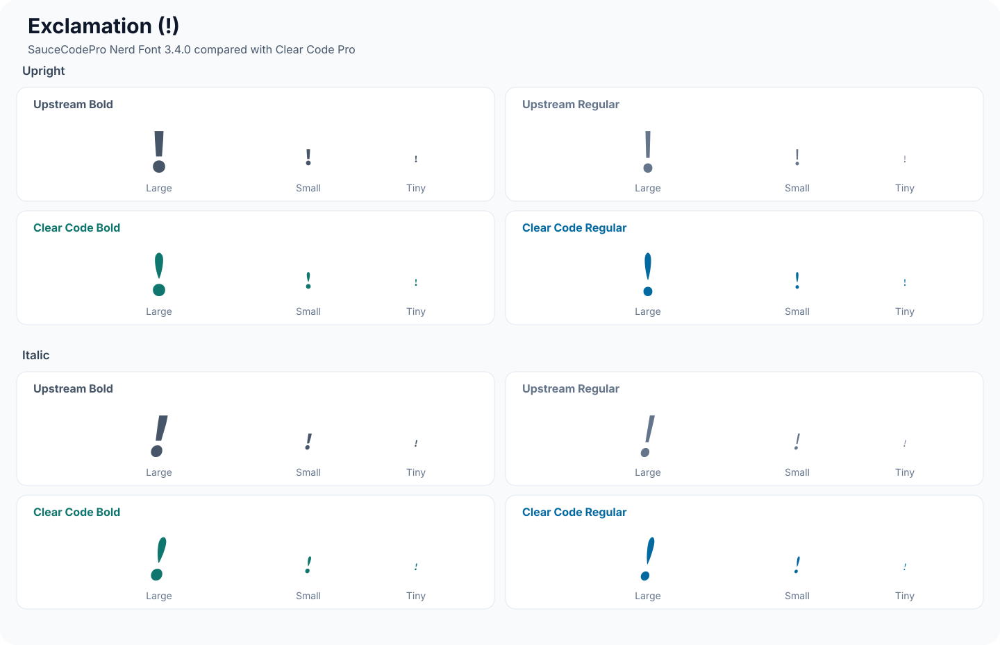
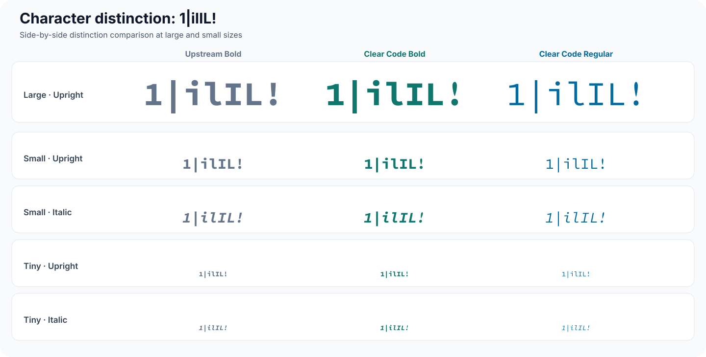

# Clear Code Pro

Clear Code Pro is a customized programming-font family derived from
[SauceCodePro Nerd Font](https://github.com/ryanoasis/nerd-fonts), which is a
Nerd Fonts build of Adobe's
[Source Code Pro](https://github.com/adobe-fonts/source-code-pro).

The family retains the Nerd Fonts glyph set and adds punctuation and numeral
changes intended to improve character distinction and readability at small
sizes. See [FONTLOG.txt](FONTLOG.txt) for the modification history.

## Modified glyph previews

These previews compare the exact glyph outlines from SauceCodePro Nerd Font
3.4.0 with Clear Code Pro. Each modified character has separate upright and
italic 2×2 grids comparing upstream bold, upstream regular, Clear Code Pro
bold, and Clear Code Pro regular. Every grid cell shows the glyph at both large
and small sizes.

### Zero

### One

### Tilde

### Exclamation mark

### Percent sign

### Ampersand

### Character distinction

The modified `1` and `!` make the sequence `1|ilIL!` easier to distinguish,
especially at small sizes.

## Font families

The release includes seven weights, with upright and italic styles, in three
families:

- **[Clear Code Pro](fonts/ClearCodePro)** — the standard Nerd Font variant, with larger icons where
  supported
- **[Clear Code Pro Mono](fonts/ClearCodeProMono)** — strictly monospaced for terminals and editors that
  require it
- **[Clear Code Pro Propo](fonts/ClearCodeProPropo)** — proportional spacing for graphical applications

## Installing

1. Download the `.ttf` files for the family and weights you want.
2. Install them using your operating system's font manager.
3. Select `Clear Code Pro`, `Clear Code Pro Mono`, or `Clear Code Pro Propo` in
   your application.

## License and permitted use

Clear Code Pro is Font Software licensed under the
[SIL Open Font License, Version 1.1](LICENSE.txt) (OFL-1.1), because it is a
modified version of OFL-licensed Source Code Pro.

In practical terms:

- You may use the fonts for personal, educational, nonprofit, and commercial
  purposes. Documents, images, logos, videos, applications, and other works
  created with the fonts may be sold and do not become subject to the OFL.
- You may copy, embed, modify, and redistribute the fonts under the terms of
  the OFL.
- When redistributing the font files, you must include the copyright notices
  and the OFL license.
- The font files may not be sold by themselves. They may be bundled and sold
  with software or other qualifying material as allowed by the OFL.
- Modified versions must remain under OFL-1.1 and must not use Adobe's reserved
  font name `Source`.
- The names of copyright holders and authors may not be used to imply their
  endorsement of a modified version.

Attribution to Clear Code Pro, Nerd Fonts, and Source Code Pro is appreciated
whenever you use the font, but the OFL does not require attribution merely for
creating a document or other work with it.

If you distribute a modified version, please document your changes in a
`FONTLOG.txt` or similar changelog. This is a project request and good open-font
practice, not an additional license condition.

The full, controlling terms are in [LICENSE.txt](LICENSE.txt). This summary is
not a substitute for the license.

## Publishing a release

Releases use [Semantic Versioning](https://semver.org/), with Git tags prefixed
by `v` (for example, version `1.0.0` uses tag `v1.0.0`).

Publishing is deliberately manual:

1. Open the repository's **Actions** tab on GitHub.
2. Select **Publish release**.
3. Choose **Run workflow**.
4. Enter a Semantic Version without the `v` prefix, such as `1.0.0`.
5. Select **Run workflow** to package and publish the release.

The workflow validates the version, packages all three font families with this
README, the license, and `FONTLOG.txt`, creates the corresponding Git tag, and
publishes the ZIP as the latest GitHub Release with a standard description. The
workflow runs only through the manual `workflow_dispatch` button; commits and
pushes do not publish releases.

## Credits

- Clear Code Pro customization: CrazyKidJack
- SauceCodePro Nerd Font and icon patching:
  [Nerd Fonts](https://github.com/ryanoasis/nerd-fonts)
- Source Code Pro: Adobe, designed by Paul D. Hunt; additional credited
  authorship in the font metadata includes Teo Tuominen

`Source` is a trademark of Adobe in the United States and/or other countries.
The `Source` reserved font name is not used as Clear Code Pro's primary font
name.
